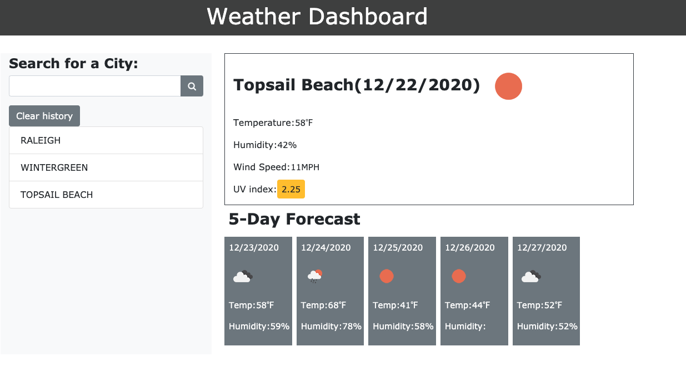

## Weather Dashboard
A weather dashboard that will return current conditions and forecast data.

## Features

* Weather can be searched by City and it will return weather information
* Weather information provided:
  * Current Date and Conditions
  * Temperature
  * Humidity
  * Wind Speed
  * UV Index
  * 5 Day Forecast

## Screenshots

## Technologies

<b>Project Created With</b>
- [OpenWeather API](https://openweathermap.org/api)

## Link to deployed application 

[Weather Dashboard](https://meddle74.github.io/bikeTrailAdvisor/)

## License

[MIT License](https://opensource.org/licenses/MIT)
